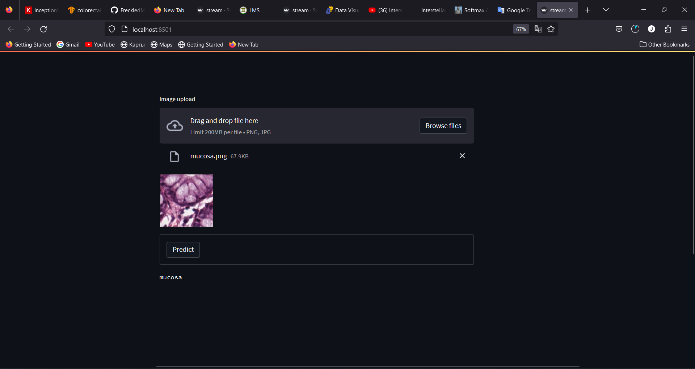
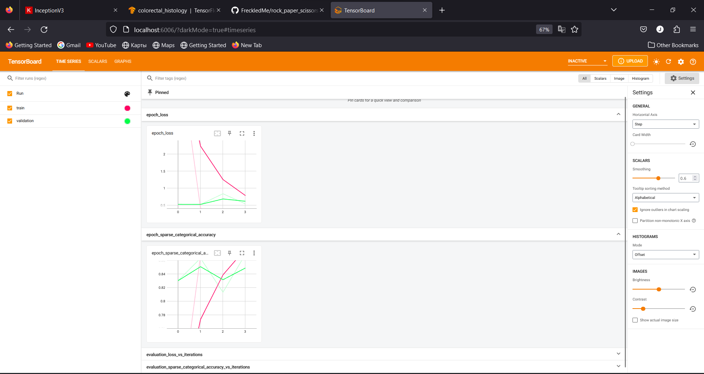

# colorectal_histology
 <a name="readme-top"></a>


<!-- PROJECT LOGO -->
<br />
<div align="center">
  <a href="https://github.com/FreckledMe/colorectal_histology">
    
  </a>


  <p align="center">
  </p>
</div>


<!-- TABLE OF CONTENTS -->
<details>
  <summary>Table of Contents</summary>
  <ol>
    <li>
      <a href="#about-the-project">About The Project</a>
      <ul>
        <li><a href="#built-with">Built With</a></li>
      </ul>
      <ul>
        <li><a href="#installation">Installation</a></li>
      </ul>
    </li>
    <li><a href="#contact">Contact</a></li>
  </ol>
</details>


<!-- ABOUT THE PROJECT -->
## About The Project


Content

This data set represents a collection of textures in histological images of human colorectal cancer. It contains two files:

"Kather_texture_2016_image_tiles_5000.zip": a zipped folder containing 5000 histological images of 150 * 150 px each (74 * 74 µm). Each image belongs to exactly one of eight tissue categories (specified by the folder name). 
"Kather_texture_2016_larger_images_10.zip": a zipped folder containing 10 larger histological images of 5000 x 5000 px each. These images contain more than one tissue type. 

Image format

All images are RGB, 0.495 µm per pixel, digitized with an Aperio ScanScope (Aperio/Leica biosystems), magnification 20x. Histological samples are fully anonymized images of formalin-fixed paraffin-embedded human colorectal adenocarcinomas (primary tumors) from our pathology archive (Institute of Pathology, University Medical Center Mannheim, Heidelberg University, Mannheim, Germany).

Ethics statement

All experiments were approved by the institutional ethics board (medical ethics board II, University Medical Center Mannheim, Heidelberg University, Germany; approval 2015-868R-MA). The institutional ethics board waived the need for informed consent for this retrospective analysis of anonymized samples. All experiments were carried out in accordance with the approved guidelines and with the Declaration of Helsinki.

More information / data usage

For more information, please refer to the following article. Please cite this article when using the data set.

Kather JN, Weis CA, Bianconi F, Melchers SM, Schad LR, Gaiser T, Marx A, Zollner F: Multi-class texture analysis in colorectal cancer histology (2016), Scientific Reports (in press)

![Product Name Screen Shot][product-screenshot]

<p align="right">(<a href="#readme-top">back to top</a>)</p>


### Built With

* [![Python][Python]][Python-url]
* [![Tensorflow][Tensorflow]][T-url]
* [![Jupyter Notebook][Jupyter]][J-url]
* <a href="https://streamlit.io/"> </a>
<p align="right">(<a href="#readme-top">back to top</a>)</p>
 


### Installation


1. Clone the repo and extract zip file
   ```sh
   git clone https://github.com/FreckledMe/colorectal_histology.git
   ```
2. Open a terminal via this extracted folder location
   ```sh
   pip install virtualenv
   ```
3. Create environment for project
   ```sh
   python<version> -m venv <virtual-environment-name>
   ```
4. Activate environment
   ```sh
   environment_path\<virtual-environment-name>\Scripts\activate
   ```
5. Install required libraries
   ```sh
   (virtual-environment-name) pip install -r requirements.txt
   ```
6. Run [colorectal_histology.ipynb ](https://github.com/FreckledMe/colorectal_histology/blob/main/colorectal_histology.ipynb)

<p align="right">(<a href="#readme-top">back to top</a>)</p>


<!-- USAGE EXAMPLES -->
## Usage
   Use [Streamlit](https://github.com/streamlit/streamlit) 

   If you don't want to train the model, you can use my pre-trained [model](https://drive.google.com/file/d/1j8gmrk9MvvbP2mdhv2dH_3D0FPt-yxga/view?usp=share_link) 

   ```sh 
   (virtual-environment-name)/streamlit run stream.py
   ```
Example result



   View loss and accuracy in per epoch via [Tensorboard](https://github.com/tensorflow/tensorboard)
   ```sh
   (virtual-environment-name)/tensorboard --logdir logs
   ```
Example result




<p align="right">(<a href="#readme-top">back to top</a>)</p>

## Contact

[![LinkedIn][linkedin-shield]][linkedin-url]

<a href="mailto:justfrozenak@gmail.com"> </a>

<p align="right">(<a href="#readme-top">back to top</a>)</p>


<!-- MARKDOWN LINKS & IMAGES -->

[linkedin-shield]: https://img.shields.io/badge/-LinkedIn-black.svg?style=for-the-badge&logo=linkedin&colorB=555
[linkedin-url]: https://www.linkedin.com/in/kamoliddin-jabbarov-599b56201/
[product-screenshot]: images/c_h.png

[Python]: https://staging.python.org/static/community_logos/python-powered-w-70x28.png
[Python-url]: https://python.org/
[Tensorflow]:  https://img.shields.io/badge/TensorFlow-FF6F00?style=for-the-badge&logo=tensorflow&logoColor=white
[T-url]: https://www.tensorflow.org/
[Jupyter]: https://img.shields.io/badge/jupyter-%23FA0F00.svg?style=for-the-badge&logo=jupyter&logoColor=white
[J-url]: https://jupyter.org/
